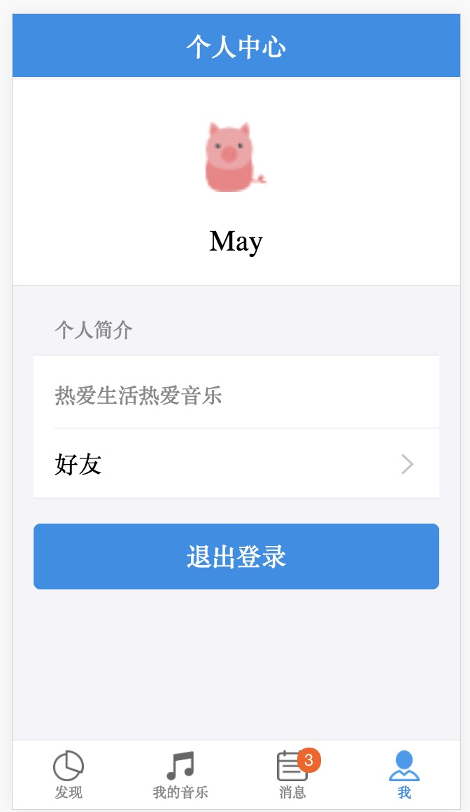
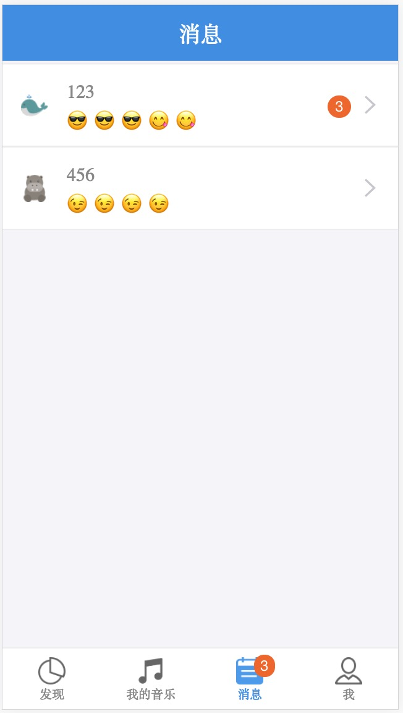
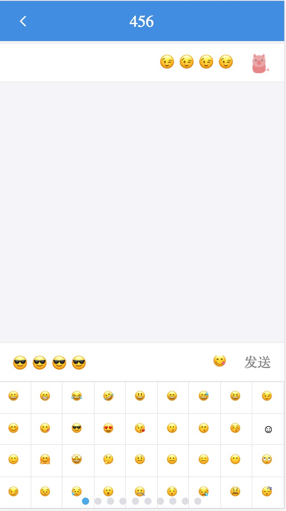

## 关于音乐数据接口

   应用中的音乐数据接口来自酷狗音乐，仅用于个人研究使用，涉及版权问题请联系删除

   API接口整理于: https://github.com/ecitlm/Kugou-api

## 项目简介：

   本项目是一个基于react+redux和express+mongoose实现的音乐app，主要实现了三大模块的功能，用户模块功能，用户交流模块功能和音乐播放模块功能

## 项目预览

  + 用户模块

 
 

 + 用户交流模块

 
 

 + 音乐播放模块
  
 
   

## 运行项目

  + 获取项目:

        git clone git@github.com:Faye1208/my-music-app.git

  + 打开项目所在目录:

        cd my-music-app/

  + 安装项目依赖：

        npm install

  + 启动后台服务器：

        node server/server.js

  + 启动前端服务器：

        npm start

## 技术栈

 + 构建：使用create-react-app脚手架

 + 前端：

    + ES版本：ES2015

    + 渲染层：React + React-DOM

    + 数据层：Redux + React-Redux + Redux-thunk + axios

    + UI组件库：Ant- Mobile

    + CSS预处理器：Sass

    + 路由：React-Router

    + 音乐：audio

+ 后端：

    + 数据库模型：mongoose

    + 数据库操作及创建接口：express

+ 实时通信：Socket-io

## 实现的功能

 + 用户模块

    + 用户注册、登录和退出

    + 添加和查看个人信息

 + 用户交流模块

    + 消息列表实现未读消息数量实时更新

    + 交流页面实现加载聊天记录、发送信息、接收信息

 + 音乐播放模块

    + 音乐播放页面，实现了音乐的播放/暂停、音乐播放进度条、歌词与音乐同步滚动及歌词高亮

    + 把用户已经听过的歌曲添加到"我的音乐"页面

## 开发难点

   + 多层路由嵌套并且需要保持对应的样式准确显示

   + 音乐播放时需要同步歌词滚动且高亮歌词

   + 实时通信的数据处理，需要根据用户筛选出对应的数据

## 开发流程总结

   后端：使用mongoose创建数据模型，express创建数据接口以及操作数据库。

   前端：使用React创建UI页面，然后通过使用中间件React-thunk扩展Redux处理异步能力，从而做到可以在Redux里面向后端请求数据，拿到后端返回的数据以后调用action creator返回相应的action，然后reducer根据action的类型返回对应的state，那么在React方面可以某个组件可以通过connect()这个组件与Redux进行链接，然后根据需要引入相应的函数，在指定的事件或者声明周期函数中调用这个函数，然后Redux就会进行相关处理得到相应的state，那么这个组件就可以通过的this.props访问到相应的数据。

   整个过程：后端进行数据操作，然后把这些数据放在某个接口当中，然后前端就在Redux当中向后端发送请求拿到大部分数据，接着React组件根据自己的需要到Redux中拿自己需要的数据。

   其中通常组件当中的事件和某些生命周期函数起到的一个很重要的作用就是调用某个action creator或者中间件函数，从而触发Redux的一系列操作，然后得到某些数据。

